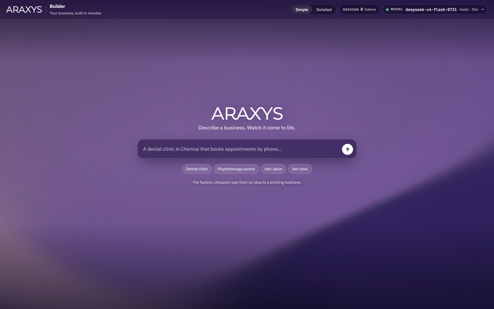
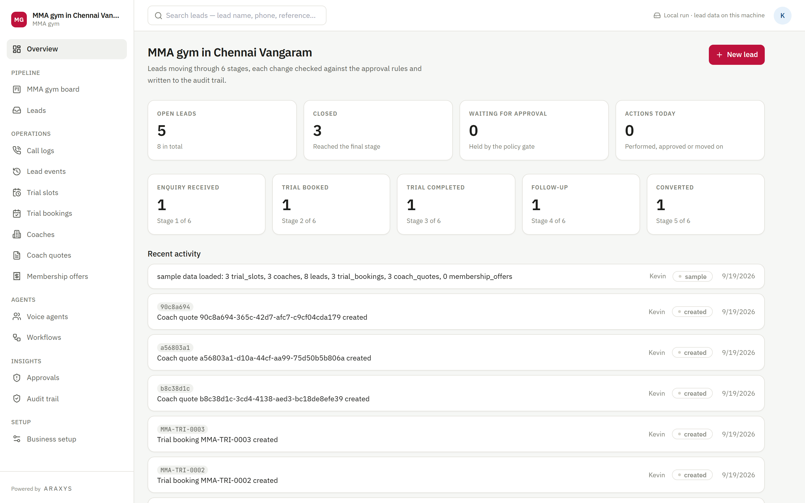
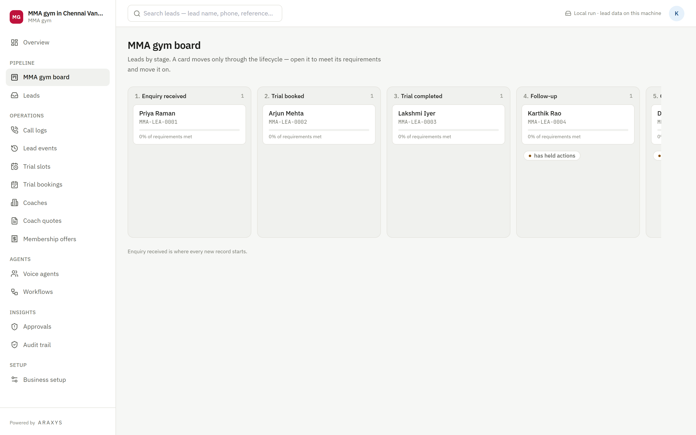
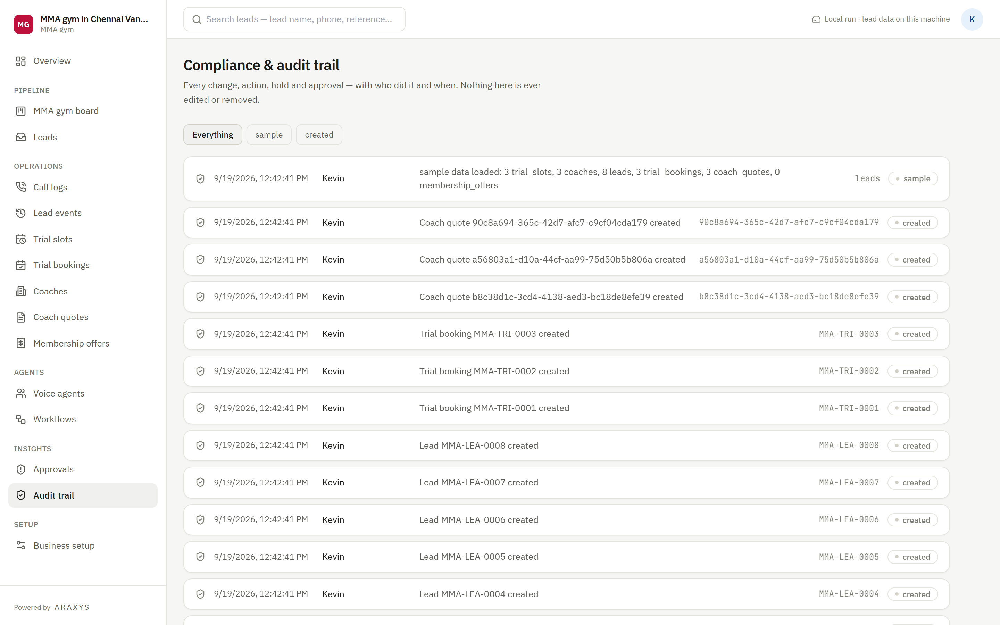

<div align="center">

# Domain-Specific Harness

**Describe a business. Get a working operations system.**

A library of operations modules — billing, pipeline, mail, scheduling, procurement,
approvals, audit — that compose into complete business software. Describe what you do in
one line and the harness assembles the modules you need, provisions the workflows, the
voice agents and the memory, and hands you a running application.

</div>



---

## The idea

Business software is not a hundred different products. It is the same dozen modules
rearranged: something that holds a record and moves it through stages, something that bills
for it, something that reads the mail, something that books time or space, something that
decides what a human has to approve, and something that remembers what happened.

A freight desk, a dental clinic and a law firm each use a different subset in a different
vocabulary. They are not different systems. They are different **compositions**.

So this ships the modules, not the products. Each one is generic, driven by a manifest
rather than hand-written per industry, and a build is a selection of them wired to a
lifecycle. That is why one codebase can stand up a hundred different businesses without a
hundred codebases behind it.

---

## The module catalogue

Every module below is generic and manifest-driven — it renders and behaves according to the
build that mounted it, not according to any one industry.

| Module | What it gives a business |
| --- | --- |
| **Pipeline board** | The core record moving through its stages, with the legal next actions on each. |
| **Record desk** | A record's full detail, its timeline, and the actions available right now. |
| **Registers** | A list view for every entity the business keeps — customers, jobs, assets, anything. |
| **Billing** | Priced lines, quotes and invoices, with margin computed against what the job cost. |
| **Money rail** | Payment links and settlement, gated by amount before anything moves. |
| **Mail desk** | Inbound mail read into structured records, and requests sent out over email. |
| **Call desk** | Calls transcribed and read into structured records after the conversation ends. |
| **Scheduling** | Bookable capacity — slots, rooms, chairs, containers — and reservations against it. |
| **Procurement** | Partners, rate requests and the quotes that come back, compared side by side. |
| **Approvals** | The policy queue: everything the system declined to do alone, waiting on a human. |
| **Audit trail** | Append-only record of every action, who took it and when. Reversal appends. |
| **Deadline sentinel** | Sweeps everything open against the clock and escalates before a date is missed. |
| **Memory** | A knowledge graph per business, answering questions about its own history. |
| **Voice agents** | Phone agents that answer as the business, grounded in its own reference data. |
| **Workflows** | The automation layer connecting all of the above to the outside world. |
| **Business setup** | The configuration surface: stages, thresholds, reference data. |

Sixteen modules. A gym uses the pipeline, scheduling, billing, approvals and call desk. A
law firm uses the record desk, billing, mail, approvals and audit. A freight consolidator
uses nearly all of them. **The combinations are where the hundreds of business softwares
come from** — and none of them require new code.

---

## What a composition looks like

This is a built business. Its own name, its own vocabulary, its own stages — assembled from
the modules above, with nothing written by hand.



The navigation is not authored. Each entry is a module the build mounted, named in the
business's own words: "leads" rather than records, "trial bookings" rather than
reservations, "coaches" rather than partners.



The same pipeline module, showing this business's own stages. A card carries how much of
its stage's requirements are met, and the amber badge marks a record with an action the
policy gate held back — nothing above a threshold happens on its own, and whoever requested
it cannot be the one who approves it.



Every action ever taken, with the person who took it. Reversal appends a new entry rather
than deleting the old one, so the trail cannot be edited into a different story.

---

## What sets it apart

### Self-configuring workflows

Automation is not left as an exercise. A build's workflows are generated, credentialled and
imported for it.

The harness creates the API credential, clones the workflow graph for that business, and
**bakes the build's own URLs into the node definitions at import time** rather than relying
on environment variables — hosted n8n restricts `$env` and licence-gates the alternative,
which is the failure mode where every call quietly posts to `undefined/...` and nothing
errors anywhere. Re-running updates in place instead of duplicating, because five copies of
one workflow listening on the same path makes which one answers a coin toss.

Workflows arrive **switched off**. Going live is a deliberate act rather than a side effect
of deploying — and the deploy says so when it could not activate, instead of leaving you to
find the silent 404s later.

### Voice agents that answer as the business

Each build gets its own phone agents, cloned from the voice module and rewritten for that
business: its greeting, its prompt, its extraction schema, its reference data as knowledge
sources.

Names are checked against the live account before creation, so two builds can never collide
on one. Agents are created as drafts with no phone number and no webhook — a generated agent
cannot answer a real call until someone connects it on purpose.

Extraction happens **after** the call, not during it. A voice model deciding mid-sentence
whether to file a customs entry is a worse design than a model reading the finished
transcript with the whole record in front of it, and it is the one the stack actually
supports.

### Memory that degrades instead of blocking

Every business gets its own knowledge graph, seeded with prose about what it does and then
built out from its own ledger as it runs. It answers questions about its own history and
rebuilds its reference data as the underlying records change.

The important property is the failure mode: **memory returns empty and never throws.** An
outage must not stop someone taking a booking. The record-of-truth adapter does the exact
opposite and fails loudly, because silently dropping a commitment is worse than an error.
Those two choices are deliberate, and deliberately opposite.

---

## How a build happens

```bash
npm run fork -- "a dental clinic in Chennai that books appointments by phone"
npm run app -- <build-name>
```

One model call produces a *delta* — which stages this business has, what its records are
called, which modules it needs. Everything after that is deterministic: the schema, the
workflow graphs, the agent prompts and the configuration are generated from the delta, not
written by the model. Mechanical slips are repaired in code; anything else is rejected.

Lifecycle configs for a range of business shapes ship with it, so a request is matched to
the closest and adapted rather than invented from nothing. When nothing matches well enough
it returns **no match** rather than a default — a wrong starting shape hands every
downstream decision a lifecycle from the wrong industry while looking perfectly confident.

---

## Safety properties

Deliberate and tested, not aspirations:

- **Legality and authority are separate questions.** One asks whether an action is possible
  in this state; the other asks whether a human must approve it. Both must pass.
- **Nothing happens without a ledger entry.** The action is passed *through* the ledger as a
  callback, so there is no code path that performs something and forgets to record it.
- **Approval is not self-service.** The requester cannot approve their own held action, and
  approval re-checks legality rather than trusting the earlier verdict.
- **Auth fails closed.** The service refuses to start without its secret. No
  `if (secret && ...)` anywhere — that shape passes when the secret is unset.
- **Builds are isolated.** Everything a build creates is namespaced to it, and touching it
  again requires both the recorded id *and* the namespaced name read back live.

---

## Running it

```bash
npm install
cp .env.example .env
npm start                     # core service on :8788
npm run builder:web           # builder UI on 127.0.0.1:8790
npm test                      # 522 checks, no network or keys required
```

The builder UI binds loopback only and rejects non-local Host headers — it holds privileged
keys. `--lan` adds this machine's network behind an access key; `--public` is the hosted
mode in [docs/HOSTING.md](docs/HOSTING.md).

---

## Layout

```
src/domain/        the kernel: state machine, policy gate, commitments — pure, no I/O
src/engines/       audit ledger, deadline sentinel, intake, procurement, margin, risk
src/verticals/     lifecycle configs — pure data, validated, no code
src/builder/       composition, routing, planning, provisioning, the builder UI
src/app-runtime/   serves a build as its own standalone application
src/memory/        the knowledge graph client
apps/crm-shell/    the module library every built app renders through
n8n/               the workflow graphs
```

---

## Status

**Proven** — the kernel, the module library, the policy gate, the audit ledger, the build
path, the app runtime and the provisioning isolation rules. Covered by the suite and
exercised by real builds.

**Wired, not proven at volume** — call extraction runs and typechecks but has not been
exercised against live transcripts at scale. The money rail has its shape and its gate, but
its callback does not yet verify the provider's checksum, so it must not release anything
until that lands.

**Not built** — outbound calling, and the pricing and compliance sub-agents.

---

<div align="center">
<sub>Built with the Araxys harness.</sub>
</div>
